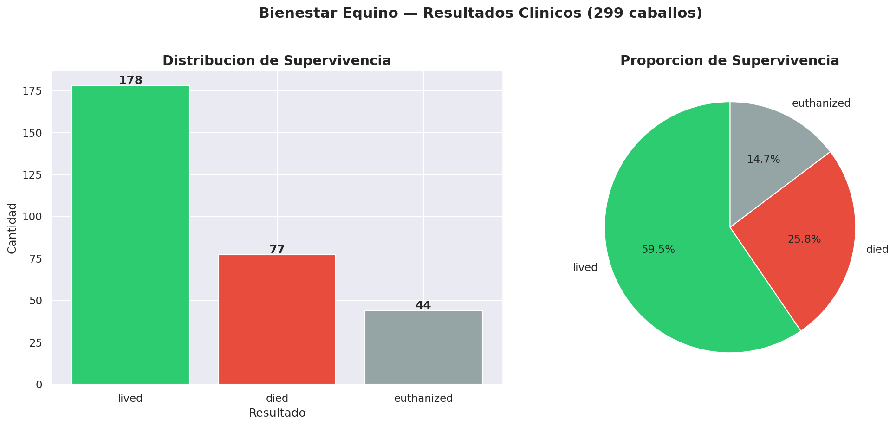
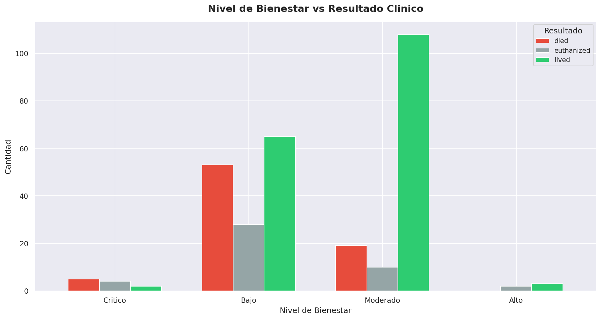
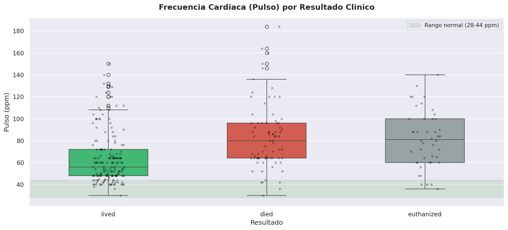
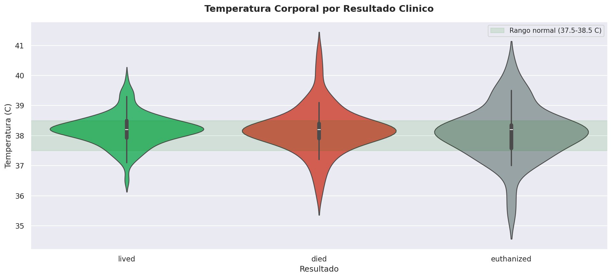
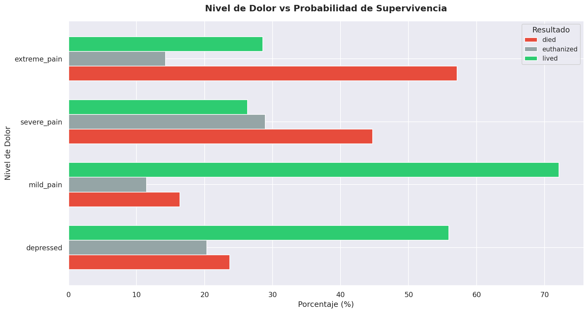
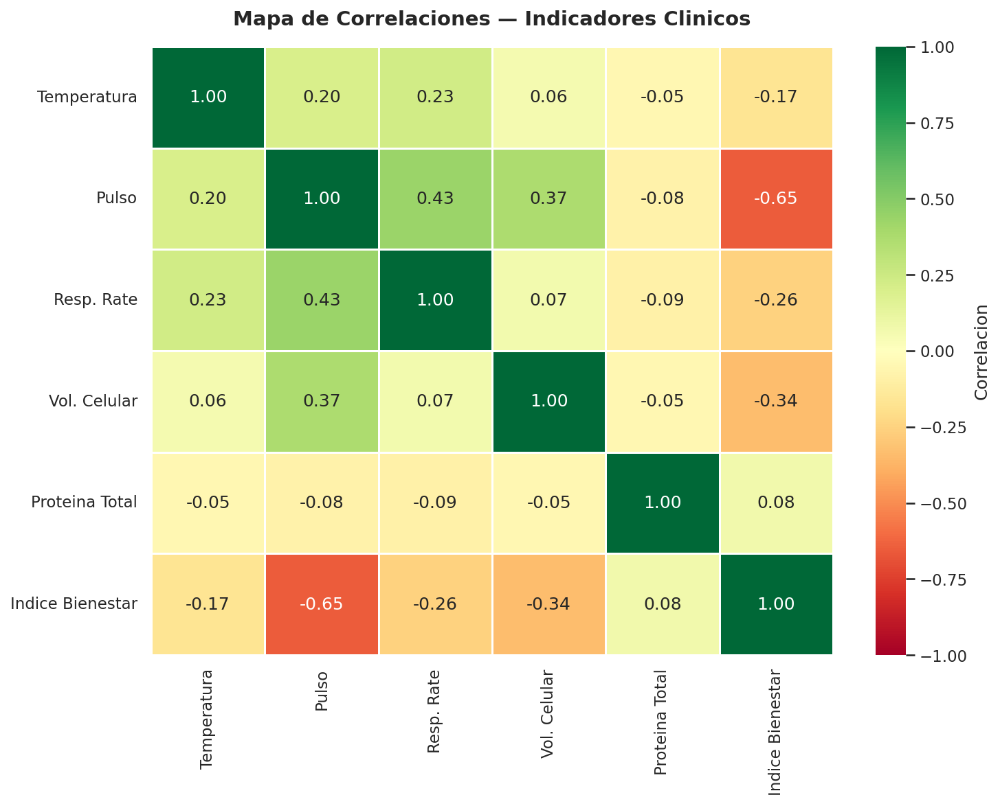
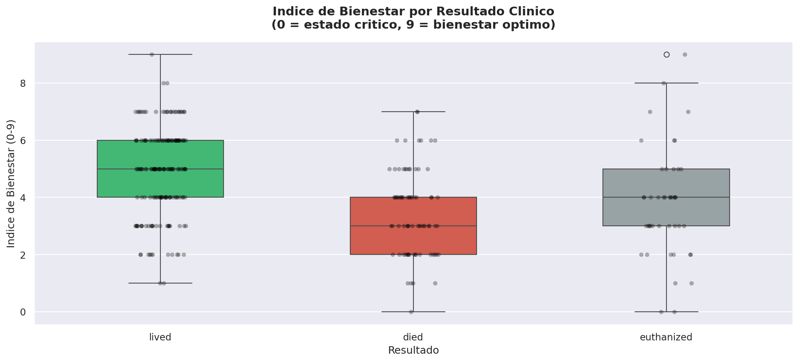
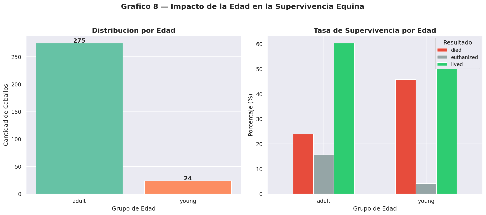
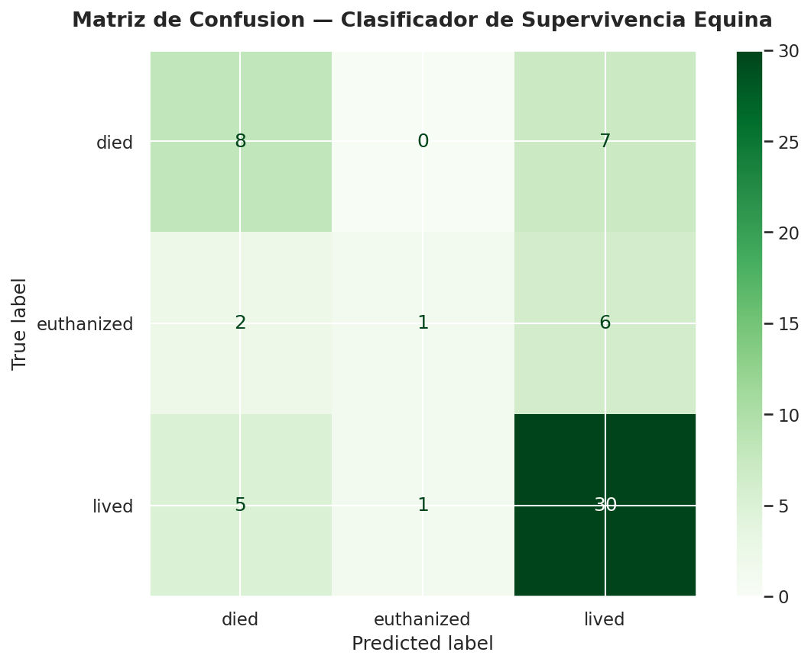
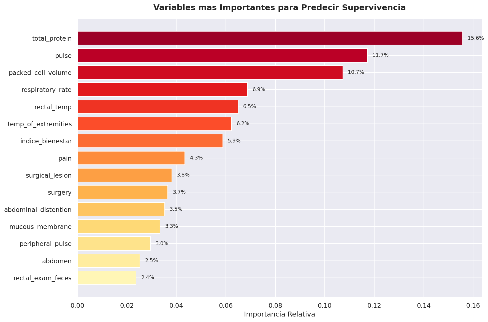

# 🐎 Bienestar y Supervivencia Equina
## Predicción de riesgo clínico en caballos usando Machine Learning


---

## 📌 Descripción

Este proyecto analiza datos clínicos de **299 caballos** para identificar
patrones de estrés, dolor y bienestar, y predecir la probabilidad de
supervivencia mediante modelos de Machine Learning.

Además, se desarrolló un **Índice de Bienestar Equino propio**, basado en
indicadores clínicos relevantes, que permite clasificar el estado de salud
de los animales de forma interpretable.

> *"Los datos clínicos cuentan una historia de sufrimiento o bienestar
> antes de que cualquier diagnóstico sea evidente."*

---

## 🎯 Objetivo del proyecto

Desarrollar un modelo capaz de:

- Predecir la supervivencia de caballos a partir de variables clínicas
- Identificar factores de riesgo asociados a mortalidad
- Construir un índice de bienestar interpretable
- Apoyar la toma de decisiones clínicas en etapas tempranas

---

## ❓ Preguntas que responde

1. ¿Qué indicadores clínicos están asociados con mayor mortalidad?
2. ¿La edad influye en la supervivencia?
3. ¿Qué variables son más predictivas del resultado clínico?
4. ¿Puede un modelo clasificar correctamente el nivel de riesgo?
5. ¿Cómo se distribuye el bienestar en la población analizada?

---

## 🧪 Dataset

- **Fuente:** Kaggle — Horse Survival Dataset
- **Registros:** 299 caballos
- **Tipo de datos:** Clínicos (pulso, temperatura, dolor, etc.)

---

## ⚙️ Metodología

1. Limpieza y preprocesamiento de datos
2. Análisis exploratorio (EDA)
3. Ingeniería de variables
4. Construcción del Índice de Bienestar
5. Entrenamiento de modelo Random Forest
6. Evaluación del modelo

---

## 🤖 Modelo de Machine Learning

Se entrenó un modelo de clasificación para predecir tres resultados:
- **Lived** — Sobrevive
- **Died** — Muere
- **Euthanized** — Sacrificado

### 📊 Resultados

| Clase | Precision | Recall | F1-Score |
|-------|-----------|--------|----------|
| Lived | 0.70 | 0.83 | 0.76 |
| Died | 0.53 | 0.53 | 0.53 |
| Euthanized | 0.50 | 0.11 | 0.18 |
| **Accuracy** | | | **65%** |

### 🧠 Interpretación

El modelo logra identificar correctamente el **83% de los caballos que
sobreviven**, lo que lo convierte en una herramienta útil para priorizar
atención clínica en etapas tempranas.

---

## 🔍 Hallazgos clave

- La **proteína total en sangre** es el predictor más importante de supervivencia
- Los caballos **jóvenes** presentan mayor mortalidad (**45.8%**)
  en comparación con adultos (**24%**)
- Variables fisiológicas como **pulso** y **temperatura** tienen
  alta relación con el estado clínico

> 📌 *Altos niveles de proteína pueden indicar deshidratación o procesos
> inflamatorios, aumentando el riesgo de mortalidad.*

---

## 📊 Índice de Bienestar Equino (propio)

Se diseñó un índice original **(0–9)** basado en:

| Indicador | Peso |
|-----------|------|
| Pulso | 3 puntos |
| Temperatura | 2 puntos |
| Dolor | 3 puntos |
| Peristalsis | 2 puntos |

### Clasificación por nivel

| Nivel | Rango | Tasa de Supervivencia |
|-------|-------|-----------------------|
| Alto | 8–9 | 60% |
| Moderado | 5–7 | 79% |
| Bajo | 2–4 | 45% |
| Crítico | 0–1 | 18% |

---

## 📈 Visualizaciones

| Gráfico | Descripción |
|---------|-------------|
|  | Distribución de supervivencia |
|  | Bienestar vs resultado clínico |
|  | Pulso por resultado |
|  | Temperatura por resultado |
|  | Dolor vs supervivencia |
|  | Mapa de correlaciones |
|  | Índice de bienestar por resultado |
|  | Impacto de la edad |
|  | Matriz de confusión ML |
|  | Variables más importantes |

---

## 💼 Aplicación práctica

Este modelo puede ser utilizado en contextos veterinarios para:

- Identificar caballos en alto riesgo de mortalidad
- Priorizar atención clínica
- Apoyar decisiones de tratamiento o eutanasia
- Mejorar la gestión de recursos en clínicas o centros ecuestres

---

## 🛠️ Tecnologías utilizadas

- **Python 3.12**
- **Pandas** — manipulación de datos
- **Matplotlib / Seaborn** — visualización avanzada
- **Scikit-learn** — Random Forest, StandardScaler
- **Google Colab** — entorno de desarrollo
- **GitHub** — control de versiones

---

## 🚀 Cómo ejecutar
```bash
git clone https://github.com/George1902/bienestar_equino.git
cd bienestar_equino
pip install -r requirements.txt
```

1. Descargar dataset desde [Kaggle](https://www.kaggle.com/datasets/yasserh/horse-survival-dataset)
2. Guardar como `horse.csv`
3. Ejecutar el notebook en Google Colab o Jupyter

---

## 📁 Estructura del proyecto
```
bienestar-equino/
│
├── images/
│   └── (todas las visualizaciones)
├── Analisis_Bienestar_Equino.ipynb
├── README.md
└── requirements.txt
```

---

## 📋 requirements.txt
```
pandas
matplotlib
seaborn
scikit-learn
jupyter
```

---

## 📊 Fuente de datos

**Horse Survival Dataset**
Kaggle — Yasser H
🔗 https://www.kaggle.com/datasets/yasserh/horse-survival-dataset

---

## 👨‍💻 Autor

**Jorge Ojeda**
Estudiante de Ciencia de Datos
Oracle Next Education (ONE) — Alura LATAM
📅 2026

---

## 🚀 Próximas mejoras

- Implementación de aplicación interactiva con **Streamlit**
- Optimización de hiperparámetros del modelo
- Incorporación de más variables clínicas
- Validación con datasets adicionales
- Dashboard interactivo con Power BI

---

## 📄 Licencia

Proyecto de uso educativo y libre distribución.
Los datos están disponibles públicamente en Kaggle bajo
licencia de uso abierto.
